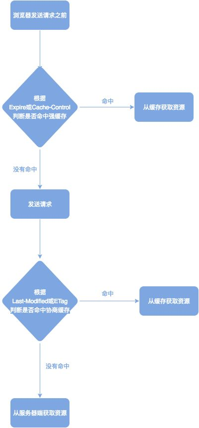

1. 常见状态码

    - 200系列（成功处理系列）

      1. 200 OK 服务器已成功处理请求
      2. 201 Created 请求成功，并且服务器已成功创建资源 返回头中会有一个location，表示创建的资源的地址
      3. 202 Accepted 表示请求已接受，但还没有创建完成
      4. 204 No Content 表示服务器已成功处理了请求，但是没有内容返回
      5. 206 Partial Content 表示服务器成功处理了部分请求 请求头中会有一个Range表示请求的范围，返回头中会带一个Content-Range表示服务器处理的范围

    - 300系列（重定向系列）

      1. 301 Moved Permanently 返回头会给出一个location头部，指明当前资源正确的地址。服务器返回此响应时，会自动将请求者转到新的位置。
      2. 302 Moved Temperarily http重定向负载均衡，调度者根据策略选择服务器以302响应请求，缺点是是由第一次有效果，后续操作维持在该服务器。
      3. 304 Not Modified 关于304请求的解释参考[这里](http://www.cnblogs.com/ziyunfei/archive/2012/11/17/2772729.html)
      4. 307 Moved Temperarily 临时移动

      对304的解释：

      如果客户端发送的是一个条件请求，则web服务器就可能会返回一个304响应，表明客户端中所请求资源的缓存仍然是有效的，可以直接使用。条件请求可以在确保客户端的资源是最新的同时避免因每次都请求完整资源给服务器带来的性能问题。

      在进行条件请求时，客户端会提供给服务器一个 **If-Modified-since**请求头，其值为服务器上次返回的 **Last-Modified**响应头中的日期值，还会提供一个 **If-None-Match**请求头，其值为服务器上次返回的 **ETag**响应头的值。服务器会读取这两个请求头中的值，判断客户端缓存的资源是否是最新的，如果是的话，服务器返回304，如果过期，返回200，响应体就是该资源当前的内容。

      只有在客户端缓存了对应资源且该资源的响应头中包含了 **Last-Modified**或 **ETage**的情况下，才可能发送条件请求。

    - 400系列（客户端错误）

      1. 400 Bad Request 服务器不理解请求的语法
      2. 401 Unauthorized 请求要求身份验证
      3. 403 Forbidden 服务器拒绝请求
      4. 404 Not Found 服务器找不到请求的资源
    
    - 500系列（服务器端错误）
    
      1. 500 Internal Server Error 服务器内部错误，无法完成请求
      2. 503 Service Unavailable 服务器不可用或者在重启过程中,通常只是暂时错误

2. http缓存

    参考[这里](https://zhuanlan.zhihu.com/p/29750583)。

    已有缓存的情况下的匹配流程：

    

    - 强缓存

      F5刷新会让强缓存失效，Ctrl+F5强制刷新也会让强缓存失效

      - Expires：http1.0版本
      - Cache-Control：http1.1版本，可使用的字段包括：

          - max-age：指定一个时间长度，在这个事件段内的缓存都是有效的
          - no-cache：强制所有缓存了该响应的用户，在使用已缓存的数据前，发送带验证器的请求到服务器。
          - no-store：禁止缓存，每次请求都要向服务器重新获取数据。

    - 协商缓存

      F5刷新不会让条件请求失效，Ctrl+F5会让条件请求失效

      指条件请求

    实际应用：

      - 考虑缓存的内容：css样式文件、js文件、logo图标、html文件、可以下载的内容
      - 不该考虑缓存的内容：业务敏感的内容

3. CDN

    参考[这里](https://github.com/renaesop/blog/issues/1)和[这里](http://hpoenixf.com/DNS%E4%B8%8ECDN%E7%9F%A5%E8%AF%86%E6%B1%87%E6%80%BB.html)。

    属于服务器缓存的一种。

    CDN(content distribution newwork)，内容分发网络。它能够实时地根据网络流量和各节点的连接、负载状况以及到用户的距离和响应时间等综合信息将用户的请求重新导向离用户最近的服务节点上。 **CDN的目的是使用户可以就近取得所需内容，解决Internet网络拥挤的状况，提高用户访问网站的响应速度**。

    - 典型的CDN系统由下面三个部分组成：

      1. 分发服务系统：最基本的工作单元就是 **Cache设备**，**边缘Cache**负责直接响应最终用户的访问请求，把缓存在本地的内容快速地提供给用户。同时cache设备还负责与源站点进行内容同步，把更新的内容以及本地没有的内容从源站点获取并保存在本地。Cache设备的数量、规模、总服务能力是衡量一个CDN系统服务能力的最基本指标。
      2. 负载均衡系统：主要功能是负责对所有发起服务请求的用户进行访问调度，确定提供给用户的最终实际访问地址。**两级**调度体系分为 **全局负载均衡**和 **本地负载均衡**。全局负载均衡主要根据用户的就近原则，通过对每个服务节点进行最优判断，确定向用户提供服务的cache的物理位置。本地负载均衡主要负责节点内部的设备的负载均衡。
      3. 运营管理系统

    - CDN的使用过程

      使用CDN只需要修改自己的DNS解析，设置一个CNAME指向CDN服务商即可。

      1. 用户访问未使用CDN缓存资源的过程：

          1. 浏览器通过前面提到的过程对域名进行解析，以得到此域名对应的IP地址。
          2. 浏览器使用所得到的IP地址，向域名的服务主机发出数据访问请求。
          3. 服务器向浏览器返回响应数据

      2. 使用CDN后

          1. 当用户点击网站页面上的内容的URL时，经过本地DNS系统解析，DNS系统会最终将域名的解析权交给CNAME指向的CDN专用DNS服务器。
          2. CDN的DNS服务器将CDN的全局负载均衡设备的IP地址返回用户。
          3. 用户向CDN的全局负载均衡设备发起访问请求。
          4. CDN全局负载均衡设备根据用户IP地址，以及用户请求的内容URL，选择一台用户所属区域的区域负载均衡设备，告诉用户向这台设备发起请求。
          5. 区域负载均衡设备会为用户选择一台合适的缓存服务器提供服务，选择的依据包括：根据用户IP地址，判断哪一台服务器距离用户最近；根据用户所请求的URL中携带的内容名称，判断哪一台服务器上有用户所需内容；查询各个服务器当前的负载情况，判断哪一台服务器上游服务能力。基于以上这些条件的综合分析之后，区域负载均衡设备会向全局负载均衡设备返回一台缓存服务器的IP地址。
          6. 全局负载均衡设备把服务器的IP地址返回给用户
          7. 用户向缓存服务器发起请求，缓存服务器响应用户的请求，将用户所需内容传送到用户终端。如果这台缓存服务器上没有用户想要的内容，而区域均衡设备依然将它分配给了用户，那么这台服务器就要向它的上一级缓存服务器请求内容，直至追溯到网站的源服务器将内容拉到本地
    - CDN的优点

        1. 加快访问速度
        2. 镜像服务，消除运营商之间的互联瓶颈影响，保证不同网络的用户都能得到良好的访问质量
        3. 远程加速，自动选择cache服务器
        4. 带宽优化，分担网络流量
        5. 集群抗攻击

4. localStorage & sessionStorage

    - 共同点：

        1. 存储大小均为5M左右
        2. 都有同源策略的限制
        3. 仅在客户端保存，不参与和服务器的通信

    - 不同点：

        1. 生命周期

            - localStorage：存储的数据是永久的，除非用户人为删除，否则会一直存在
            - sessionStorage：与存储数据的脚本坐在的标签页的有效期相同。一旦窗口或者标签页被关闭，那么所有通过sessionStorage存储的数据也会被删除

        2. 作用域

            - localStorage：同一浏览器，同源文档之间共享localstorage数据
            - sessionStorage：同一浏览器，同源文档，同一窗口（比如同一窗口里的同源iframe）

5. Cookie

    - 特点：

        1. 大小限制在4kb左右
        2. 主要用途是保存登录信息和标记用户（比如登录车），不过随着localStorage的出现，现在购物车的工作Cookie承担的较少了
        3. 一般由服务器生成，可设置失效时间。如果在浏览器端生成Cookie，默认是关闭浏览器后失效
        4. 每次都会携带在http请求头中，如果用cookie保存过多的数据会带来性能问题

    - 使用：

      服务端通过设置`Set-Cookie`这个头来控制cookie。

      可选参数：

      1. Expires：cookie的最长有效时间，如果不设置，则cookie的生命期与会话期相同
      2. Max-Age：cookie生成后失效的秒数
      3. Domain：指定cookie可以送达的主机域名，若一级域名设置了则二级域名也能获取
      4. Path
      5. Secure：必须在请求使用HTTPS协议的时候cookie才会发送到服务器
      6. HttpOnly：客户端无法更改Cookie，客户端设置cookie时，不能使用这个参数，一般是服务器端使用

6. Session

    Session是在状态HTTP协议下，服务端记录用户状态时用于标识具体用户的机制。大多数应用都是用Cookie来实现Session跟踪的，第一次创建Session的时候，服务端会在HTTP协议中告诉客户端，需要在Cookie里记录一个SessionID，以后每次请求把这个会话ID发送到服务器。

    与Cookie的关系与区别

        1. Session是服务端保存的一个数据结构，用来跟踪用户的状态，这个数据可以保存在集群、数据库、文件中。Cookie是客户端保存用户信息的一种机制，用来记录用户的一些信息，也是实现Session的一种方式。
        2. Cookie的安全性一般，他人可以通过分析存放在本地的Cookie并进行Cookie欺骗。在安全性第一的前提下，选择Session更优。重要交互信息，比如权限等就要放在Session中，一般的信息记录放在Cookie中
        3. 当访问增多时，Session会较大地占用服务器性能。考虑到减轻服务器性能方面，应当实时使用Cookie
        4. Session的运行依赖Session ID，而Session ID是存在Cookie中的。也就是说，如果浏览器禁用了Cookie，Session也会失效，可以通过比如在url中传递Session ID，如sid=xxxxxx。

7. osi模型

七层结构：物理层、数据链路层、网络层、传输层、会话层、表示层、应用层

8. http2 & https & http

    参考[这里](https://juejin.im/post/5a77fe396fb9a063317c2e71)。

    - http和https的一些qubie

      1. http运行在TCP之上，所有传输的内容都是明文的，HTTPS运行在SSL/TLS之上，SSL/TLS运行在TCP之上，所有传输的内容都是经过加密的。
      2. http和https使用的是完全不同的连接方式，用的端口也不一样，前者是80，后者是443
      3. https可以有效的防止运营商劫持，解决了防劫持的一个大问题。
    
    - http2新特性
    
      1. 新的二进制格式http1.x的解析是基于文本的，文本的表现形式有多样性，要做到健壮考虑的场景必然很多，二进制则不同，只是别0和1的组合。
      2. 多路复用，每一个request都是用作连接共享机制的。一个request对应一个id，这样一个连接上可以有多个request，每个连接的requst可以随机的混杂在一起，接收方可以根据request的id将request再归属到各自不同的服务端请求里面
      3. **服务端推送**
      4. header压缩，http2.0使用encoder来减少需要传输的header的大小，通讯双方各自cache一份headerfields表，既避免了重复header的传输，又减小了需要传输的大小。

9. XSS和CSRF

    参考[这里](https://github.com/dwqs/blog/issues/68)。

    - XSS（Cross Site Script 跨域脚本攻击）

      XSS攻击是指攻击者在网站上注入恶意的客户端代码，通过恶意脚本对客户端网页进行篡改，从而在用户浏览网页时，对用户浏览器进行控制或者获取用户隐私数据的而一种攻击方式。

      防范XSS的措施：

        - 浏览器角度：使用CSP（Content-Scurity_policy），CSP通过指定有效域——即浏览器认可的可执行脚本的有效来源，使服务器管理者有能力减少或者消除XSS攻击所依赖的载体。一个CSP兼容的浏览器仅会执行从白名单域获取到的脚本文件，忽略所有其他所有脚本（包括内联脚本和html事件处理属性）。

          在http头部设置content-security-policy。

        - 开发者角度：

          1. HttpOnly

            `Set-Cookie: name=value;HttpOnly`，浏览器将禁止页面的js访问带有HttpOnly属性的Cookie。所以严格来说，HttpOnly并非阻止XSS攻击，而是能阻止XSS攻击后的Cookie的劫持攻击。
          2. 对用户的输入进行编码或过滤
          3. 输出检查

    - CSRF（Cross Site Request Forgery 跨域请求伪造）

      CSRF攻击是攻击者借助受害者的Cookie骗取服务器的信任，可以在受害者毫不知情的情况下以受害者名义伪造请求发送给受攻击服务器，从而在并未授权的情况下执行在权限保护之下的操作。

      防范CSRF的措施：

        - 验证码：验证码只能作为防御CSRF的一种辅助手段，不能作为最主要的解决办法
        - Referer Check：http协议头部中有一个字段叫做Referer，它记录了该请求的来源地址。通过Referer Check可以检查请求是否来自合法的源。
        - 添加token验证：可以在http请求中以参数的形式传入一个随机产生的token，并在服务器端建立一个拦截器来验证这个token，如果请求中没有token或者token内容不正确，则认为可能是CSRF攻击而拒绝请求。

10. CORS

   参考[这里](http://www.ruanyifeng.com/blog/2016/04/cors.html)。

   CORS需要浏览器和服务器同时支持。目前所有浏览器都支持该功能，因此，实现CORS通信的关键是服务器，只要服务器实现了CORS，就可以实现跨域通信。

   - 简单请求

     同时满足下面两个条件：

         1. 请求方法是：HEAD、GET、POST
         2. 请求头不超出下面几种字段：

           - Accept
           - Accept-Language
           - Content-Language
           - Content-type：只限于三个值

     简单请求，在头信息中增加一个`Origin`字段，这个字段用来说明本次请求来自哪个源（协议+域名+端口）。

       - 如果`Origin`指定的源，不在许可范围内，服务器会返回一个正常的http响应。浏览器发现，这个响应的头信息没有包含`Access-Control-Allow-Origin`字段，就知道出错了，从而抛出一个错误，被XMLHttpRequest的onerror回调函数捕获。这种错误无法通过状态码识别，因为http响应的状态码有可能是200.
       - 如果`Origin`指定的域名在许可范围内，服务器返回的响应，会多出几个头信息字段，以`Access-Control-`开头。

   - 非简单请求

     请求方法是PUT或者DELETE，或者Content-Type是application/json。非简单请求的CORS请求，会在正式通信之前，增加一次http查询请求，成为预检请求。预检请求使用的是OPTIONS方法。只有得到肯定的响应才会正式发出ajax请求，否则就报错。一旦通过了预检请求，以后每次浏览器正常的CORS请求，就和简单请求一样，有一个Origin头信息字段。

11. GET & POST区别

    |          | GET                             | POST                             |
    | -------- | ------------------------------- | -------------------------------- |
    | 后退或刷新    | 无害                              | 数据会被重新提交                         |
    | 书签       | 可被收藏                            | 不可被收藏                            |
    | 缓存       | 能被缓存                            | 不能被缓存                            |
    | 历史       | 参数能保留在浏览器的历史中                   | 参数不能保存                           |
    | 对数据长度的限制 | 发送数据时，Get方法向URL添加数据，最大长度2018个字符 | 无限制                              |
    | 数据类型     | 只允许ASCII字符                      | 无限制                              |
    | 安全性      | 较差，发送的数据是URL的一部分，发送敏感信息不要使用GET  | Post更安全，因为参数不会保存在浏览器历史或web服务器日志中 |
    | 可见性      | 数据在URL中，对所有人都是可见的               | 数据不会显示在URL中                      |

    ​

